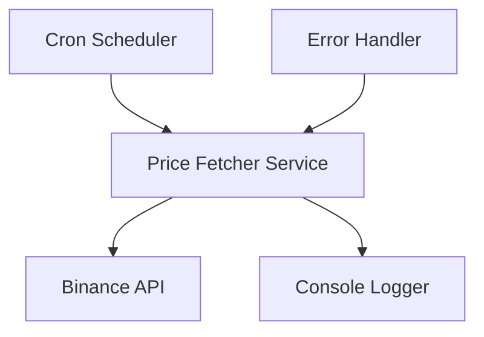
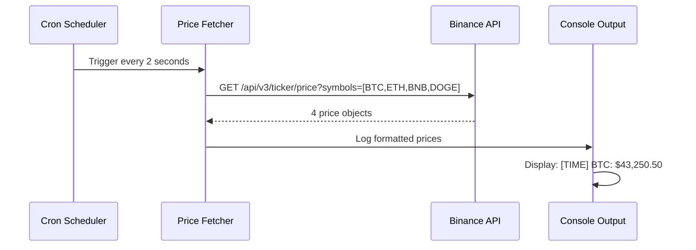
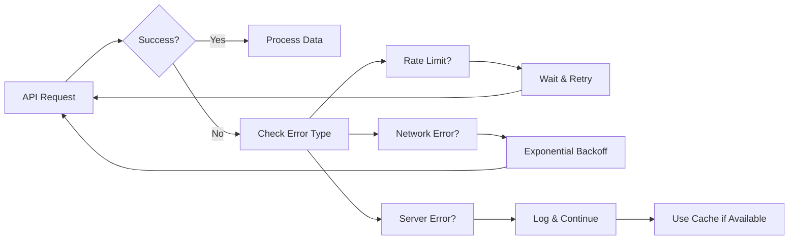

# Binance Price Checker - Node.js Application Design

## Overview

A simple Node.js backend service that monitors 4 specific cryptocurrency prices (BTC, ETH, BNB, DOGE) from Binance API at 2-second intervals using cron jobs. The application runs locally and outputs price data to console.

### Key Features

- Real-time price monitoring every 2 seconds
- Fixed 4 cryptocurrency tracking (BTC, ETH, BNB, DOGE)
- Console logging for local development
- Simple error handling
- Minimal configuration

## Technology Stack & Dependencies

### Core Technologies

- **Runtime**: Node.js (v18+)
- **HTTP Client**: axios for API requests
- **Scheduler**: node-cron for interval jobs
- **Logging**: console.log for simple output

### Development Dependencies

- **Linting**: eslint (optional)
- **Formatting**: prettier (optional)

## Architecture



### Component Architecture

#### 1. Cron Scheduler

- **Purpose**: Triggers price fetching every 2 seconds
- **Implementation**: Uses node-cron library
- **Configuration**: Fixed 2-second interval

#### 2. Price Fetcher Service

- **Purpose**: Interfaces with Binance API
- **Endpoints**: `/api/v3/ticker/price` for specific symbols
- **Target Symbols**: BTCUSDT, ETHUSDT, BNBUSDT, DOGEUSDT
- **Error Handling**: Basic error logging

#### 3. Console Logger

- **Purpose**: Simple price display
- **Output**: Formatted console.log statements
- **Format**: Timestamp, Symbol, Price

## API Integration Layer

### Binance API Configuration

#### Primary Endpoint

```
GET https://api.binance.com/api/v3/ticker/price
```

#### Request Structure

- **Method**: GET
- **Parameters**:
  - `symbols`: ["BTCUSDT","ETHUSDT","BNBUSDT","DOGEUSDT"]

#### Response Schema

```json
[
  {
    "symbol": "BTCUSDT",
    "price": "43250.50000000"
  },
  {
    "symbol": "ETHUSDT",
    "price": "2650.75000000"
  },
  {
    "symbol": "BNBUSDT",
    "price": "315.20000000"
  },
  {
    "symbol": "DOGEUSDT",
    "price": "0.08450000"
  }
]
```

### Fixed Cryptocurrency Selection

#### Target Cryptocurrencies

```javascript
const TARGET_SYMBOLS = [
  "BTCUSDT", // Bitcoin
  "ETHUSDT", // Ethereum
  "BNBUSDT", // Binance Coin
  "DOGEUSDT", // Dogecoin
]
```

#### Selection Logic

- **Fixed List**: No dynamic selection
- **Hardcoded Symbols**: Always fetch these 4 coins
- **USDT Pairs**: All symbols paired with USDT

## Business Logic Layer

### Price Monitoring Workflow



### Error Handling Strategy

#### API Failures



#### Retry Configuration

- **Rate Limit**: Wait for reset time + 1 second
- **Network Error**: Exponential backoff (2, 4, 8 seconds)
- **Server Error**: Log error, continue with next cycle
- **Max Retries**: 3 attempts per cycle

### Data Processing Logic

#### Simple Price Formatting

```javascript
const formatPrice = (symbol, price) => {
  const cleanSymbol = symbol.replace("USDT", "")
  const formattedPrice = parseFloat(price).toLocaleString("en-US", {
    style: "currency",
    currency: "USD",
  })
  return `${cleanSymbol}: ${formattedPrice}`
}
```

#### Console Output Format

```javascript
const displayPrices = (prices) => {
  const timestamp = new Date().toLocaleTimeString()
  console.log(`\n[${timestamp}] Latest Crypto Prices:`)
  prices.forEach(({ symbol, price }) => {
    console.log(`  ${formatPrice(symbol, price)}`)
  })
  console.log("-".repeat(40))
}
```

## Middleware & Configuration

### Environment Configuration

#### Simple Configuration

```javascript
const config = {
  binance: {
    apiUrl: "https://api.binance.com",
    timeout: 5000,
  },
  scheduler: {
    interval: "*/2 * * * * *", // Every 2 seconds
  },
  symbols: ["BTCUSDT", "ETHUSDT", "BNBUSDT", "DOGEUSDT"],
}
```

### Request Middleware

#### Rate Limiting Handler

```javascript
const rateLimitHandler = {
  maxRetries: 3,
  baseDelay: 1000,
  maxDelay: 10000,

  async handleRateLimit(error, retryCount) {
    if (error.response?.status === 429) {
      const retryAfter = error.response.headers["retry-after"] || 1
      await new Promise((resolve) => setTimeout(resolve, retryAfter * 1000))
      return true
    }
    return false
  },
}
```

#### Request Timeout Configuration

```javascript
const axiosConfig = {
  timeout: config.binance.timeout,
  headers: {
    Accept: "application/json",
    "User-Agent": "BinancePriceChecker/1.0",
  },
  validateStatus: (status) => status >= 200 && status < 300,
}
```

## Local Development Setup

### Running the Application

#### Start Command

```bash
node index.js
```

#### Expected Console Output

```
Binance Price Checker Started
Fetching prices every 2 seconds...

[3:45:23 PM] Latest Crypto Prices:
  BTC: $43,250.50
  ETH: $2,650.75
  BNB: $315.20
  DOGE: $0.08
----------------------------------------

[3:45:25 PM] Latest Crypto Prices:
  BTC: $43,255.75
  ETH: $2,652.10
  BNB: $315.18
  DOGE: $0.08
----------------------------------------
```

### Error Handling

#### Simple Error Logging

```javascript
const handleError = (error) => {
  console.error(`[ERROR] ${new Date().toLocaleTimeString()}: ${error.message}`)
  if (error.response) {
    console.error(
      `API Error: ${error.response.status} - ${error.response.statusText}`
    )
  }
}
```

## Testing Strategy

### Basic Application Structure

#### Main Application File (index.js)

```javascript
const cron = require("node-cron")
const axios = require("axios")

const config = {
  symbols: ["BTCUSDT", "ETHUSDT", "BNBUSDT", "DOGEUSDT"],
  apiUrl: "https://api.binance.com/api/v3/ticker/price",
}

const fetchPrices = async () => {
  try {
    const symbols = config.symbols.map((s) => `"${s}"`).join(",")
    const response = await axios.get(`${config.apiUrl}?symbols=[${symbols}]`)
    return response.data
  } catch (error) {
    console.error(`[ERROR] Failed to fetch prices: ${error.message}`)
    return []
  }
}

const displayPrices = (prices) => {
  if (prices.length === 0) return

  const timestamp = new Date().toLocaleTimeString()
  console.log(`\n[${timestamp}] Latest Crypto Prices:`)

  prices.forEach(({ symbol, price }) => {
    const coin = symbol.replace("USDT", "")
    const formattedPrice = parseFloat(price).toLocaleString("en-US", {
      style: "currency",
      currency: "USD",
    })
    console.log(`  ${coin}: ${formattedPrice}`)
  })

  console.log("-".repeat(40))
}

// Start the price checker
console.log("Binance Price Checker Started")
console.log("Fetching prices every 2 seconds...")

cron.schedule("*/2 * * * * *", async () => {
  const prices = await fetchPrices()
  displayPrices(prices)
})
```

#### Package.json

```json
{
  "name": "binance-price-checker",
  "version": "1.0.0",
  "main": "index.js",
  "scripts": {
    "start": "node index.js"
  },
  "dependencies": {
    "axios": "^1.6.0",
    "node-cron": "^3.0.3"
  }
}
```

### Installation & Usage

#### Setup Instructions

1. **Install Dependencies**: `npm install`
2. **Run Application**: `npm start`
3. **Stop Application**: `Ctrl + C`

#### Expected Behavior

- Displays prices every 2 seconds
- Shows timestamp with each update
- Handles API errors gracefully
- Clean console formatting
